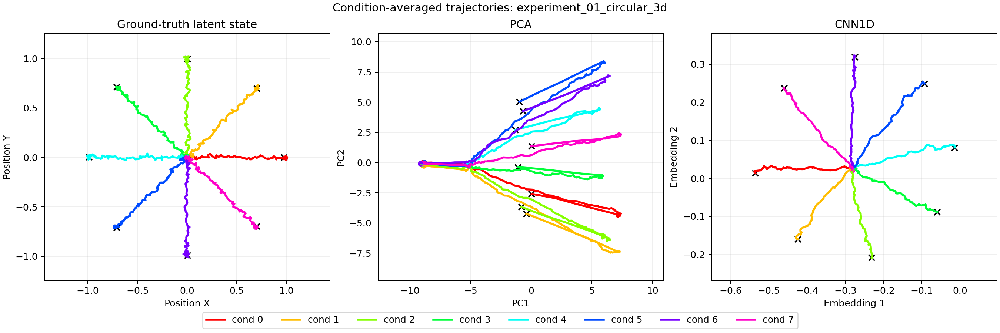

Experiments
===========

Controlled matrix
-----------------

The baseline suite varies task family and latent dimensionality while keeping
the same number of trials, time bins, neurons, window size, and encoder family.

.. list-table::
   :header-rows: 1
   :widths: 24 12 34 30

   * - Experiment
     - Latent
     - Coordinates
     - Neural tuning
   * - Circular essential
     - 3D
     - X, Y, progress
     - direction, progress, mixed
   * - Circular enriched
     - 5D
     - + velocity, context
     - heterogeneous task loadings
   * - Linear essential
     - 2D
     - position, direction
     - + localized place fields
   * - Linear enriched
     - 4D
     - + velocity, context
     - mixed and place-selective units

Evaluation protocol
-------------------

Every experiment contains 160 trials, 100 time bins, 100 neurons, and
centered 10-bin windows with stride one. Models are fitted on 80% of the
trials and evaluated on the untouched 20%. The split is performed by trial,
so windows from a test trial never enter training.

For the linear track, each trial contains both movement phases:

* ``movement_phase = 0``: outbound, position 0 to 1 and direction +1;
* ``movement_phase = 1``: return, position 1 to 0 and direction -1.

They are phases of the same trial, not two different trial classes. In the
linear figure, the first panel shows physical behavior ``0 -> 1 -> 0``. The
second shows the expected position-direction cycle: an upper outbound branch,
a turnaround at position 1, a lower return branch, and a dotted transition
from the end of one trial to the beginning of the next at position 0. PCA and
CNN1D follow in the third and fourth panels. Color represents continuous track
position, a colored circle marks segment start, a black X marks arrival, and
return is dashed.

The linear experiments also save ``realized_place_field_tuning.png``. Its
left panel shows the Gaussian fields assigned by the generator. Its right
panel bins the actual simulated rates by track position, normalizes each
place-selective neuron, and sorts neurons by preferred location. The diagonal
band has a simple interpretation: successive neurons prefer successive
locations along the normalized track. It verifies that this preference is
present in the simulated rates rather than only in configuration parameters.

Notebook execution graph
------------------------

The Jupyter notebooks keep every intermediate object in the kernel. Their
execution graph is:

.. code-block:: text

   configuration
       -> Z, condition, state
       -> B, neuron_types, place_drive
       -> u
       -> lambda
       -> X
       -> dataset, metadata
       -> train/test masks
       -> PCA embedding
       -> batch soft target Q
       -> trained CNN1D
       -> ordered CNN embedding
       -> metrics, figures, saved artifacts

The corresponding modules are visible in the import cell. Latent generation
uses :class:`neurobridge.data.sim.Lat_traj_generator.LatentTrajectoryGenerator`.
Population tuning uses ``build_structured_B`` for circular tasks and
``build_linear_loading_and_place_fields`` for linear tasks. Emission uses
``drive_to_rate`` and ``rate_to_spike``. The learning cells construct
``TemporalCNNEncoder``, ``DataLoader``, ``AdamW``,
``build_similarity_matrix``, and ``soft_contrastive_loss`` explicitly.

``train_epoch`` is deliberately narrow: it performs one epoch of repeated
PyTorch operations. It does not choose the encoder, optimizer, soft target,
loss, or number of epochs. Those choices remain editable in the notebook.

Training batches are shuffled, but time is not removed from the samples.
Every window retains ``trial_id``, ``time_id``, ``label``, and ``progress``.
The soft target ``Q`` is reconstructed from those metadata inside each batch.
Final encoding uses ``shuffle=False`` so embedding rows again match the
original trial-time order exactly.

Held-out metrics
----------------

The table reports RSA Spearman correlation on test windows. ``Full`` compares
the complete latent state. ``Core`` compares the task-defining motor
coordinates: three coordinates for the circular task and two for the linear
track.

Each value is obtained by computing all pairwise distances among known test
states, computing the corresponding pairwise distances among embedding
vectors, and correlating the two distance lists by rank. For example,
``0.927`` indicates strong preservation of the near/far ordering. It is not
92.7% accuracy and it is not, by itself, a score of loop reconstruction.

.. list-table::
   :header-rows: 1
   :widths: 28 18 18 18 18

   * - Task
     - PCA full
     - CNN1D full
     - PCA core
     - CNN1D core
   * - Circular 3D
     - 0.893
     - 0.927
     - 0.893
     - 0.927
   * - Circular 5D
     - 0.682
     - 0.619
     - 0.899
     - 0.904
   * - Linear 2D
     - 0.893
     - 0.778
     - 0.893
     - 0.778
   * - Linear 4D
     - 0.886
     - 0.803
     - 0.838
     - 0.796

.. important::

   Metrics and trajectory plots answer different questions. In the linear
   experiments, CNN1D retains substantial pairwise-distance agreement while
   visibly compressing temporal trajectories. Therefore RSA alone is not
   evidence that the full trajectory geometry has been recovered. Repeated
   seeds, confidence intervals, and objective ablations are still required.

The circular 5D result gives a second warning. Its motor core is recovered
well, but its full-space score is lower. This supports a precise claim about
position and progress; it does not establish faithful recovery of velocity
and context.

